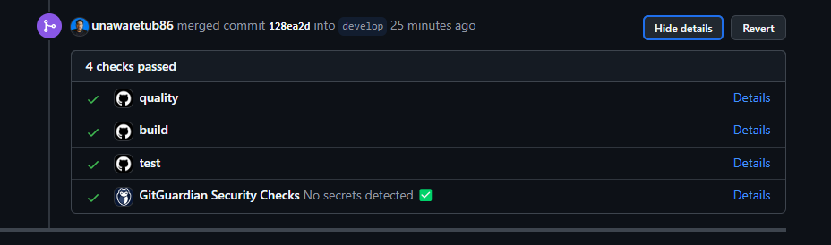

# leal-challenge
    Prueba tecnica leal

<!-- TABLE OF CONTENTS -->

  
Tabla de contenidos

  <ol>
    <li>
      <a href="#sobre-el-proyecto">Sobre el proyecto</a>
      <ul>
        <li><a href="#hecho-con">Hecho con</a></li>
      </ul>
    </li>
    <li><a href="#usage">Usage</a></li>
    <li><a href="#considerations">Consideraciones</a></li>
    <li><a href="#contacto">Contacto</a></li>
  </ol>

<!-- ABOUT THE PROJECT -->
## Sobre el proyecto

Este proyecto ha sido desarrollado en el contexto de la prueba técnica leal. En esta prueba, se presenta un servicio en cuál se busca resolver ciertos requerimientos en
el caso donde se crean nuevas campañas para acumular puntos o cashback.

Este servicio utiliza una arquitectura hexagonal diseñada para preservar la integridad de la lógica de negocio y permitir la incorporación de nuevas implementaciones a través de adaptadores, sin necesidad de modificar la lógica existente. Esta estructura proporciona flexibilidad para extender y adaptar el servicio a futuras necesidades, garantizando la coherencia de la aplicación.

En este servicio, se ha incorporado flujos de trabajo de GitHub Actions para asegurar la alta calidad de integración de Git Flow a través de pull requests. Estos flujos de trabajo incluyen acciones como construcción (build), cobertura superior al 80% (coverage) y verificación de código (lint). Esta implementación garantiza una integración fluida y una revisión exhaustiva del código, lo que nos permite mantener altos estándares de calidad en nuestro proyecto.

(<a href="#readme-top">Volver al inicio</a>)

### Hecho con

* [![Go][Go.dev]][Go-url]
* [![Postgres][Postgres.com]][Postgres-url]
* [![Github Actions][github-actions.com]][GithubActions-url]

(<a href="#readme-top">Volver al inicio</a>)

<!-- USAGE EXAMPLES -->
## Usage

Para correr este programa puedes hacerlo con el siguiente comando y tener abierto docker

make start

make init_db

Solo importa estas colecciones en postman y tendrás ejemplos para probar

* [  Commerce ](docs/Commerce.postman_collection.json)
* [ User ](docs/Users.postman_collection.json)

(<a href="#readme-top">Volver al inicio</a>)

<!-- Considerations -->
## considerations

Flujo de la lógica de negocio:

Acumulación de puntos o cashback:

Al realizar una compra, el sistema verifica si hay alguna campaña activa en la sucursal donde se realizó la compra.
Si hay una campaña, se aplican los beneficios de acuerdo con las reglas (doble puntos o porcentaje adicional).
Si no hay campaña, se acumulan los puntos o cashback bajo el factor de conversión estándar.
Consulta de campañas:

El sistema debe permitir consultar las campañas activas en una sucursal específica de un comercio para informar al usuario de los beneficios disponibles.
Redención de puntos o cashback:

El usuario puede redimir sus puntos en el comercio donde los ganó o utilizar su cashback en cualquier comercio de la red.

(<a href="#readme-top">Volver al inicio</a>)

<!-- CONTACT -->
## Contacto

Esteban Gomez - [LinkedIn](https://www.linkedin.com/public-profile/settings?lipi=urn%3Ali%3Apage%3Ad_flagship3_profile_self_edit_contact-info%3BSnAu1%2F2AQQiK8pzcnqrLUA%3D%3D) - goal.esteban10@gmail.com

Project Link: [Github repo](https://github.com/unawaretub86/leal-challenge)

(<a href="#readme-top">Volver al inicio</a>)

<!-- MARKDOWN LINKS & IMAGES -->
<!-- https://www.markdownguide.org/basic-syntax/#reference-style-links -->
[linkedin-shield]: https://img.shields.io/badge/-LinkedIn-black.svg?style=for-the-badge&logo=linkedin&colorB=555
[linkedin-url]: https://linkedin.com/in/othneildrew
[Go.dev]: https://img.shields.io/badge/go-%2300ADD8.svg?style=for-the-badge&logo=go&logoColor=white
[Go-url]: https://go.dev/
[github.com]: https://img.shields.io/badge/github-%23121011.svg?style=for-the-badge&logo=github&logoColor=white
[Github-url]: https://github.com/
[github-actions.com]: https://img.shields.io/badge/github%20actions-%232671E5.svg?style=for-the-badge&logo=githubactions&logoColor=white
[GithubActions-url]: https://github.com/features/actions
[postgres.com]: https://img.shields.io/badge/PostgreSQL-316192?style=for-the-badge&logo=postgresql&logoColor=white
[postgres-url]: https://www.postgresql.org/

